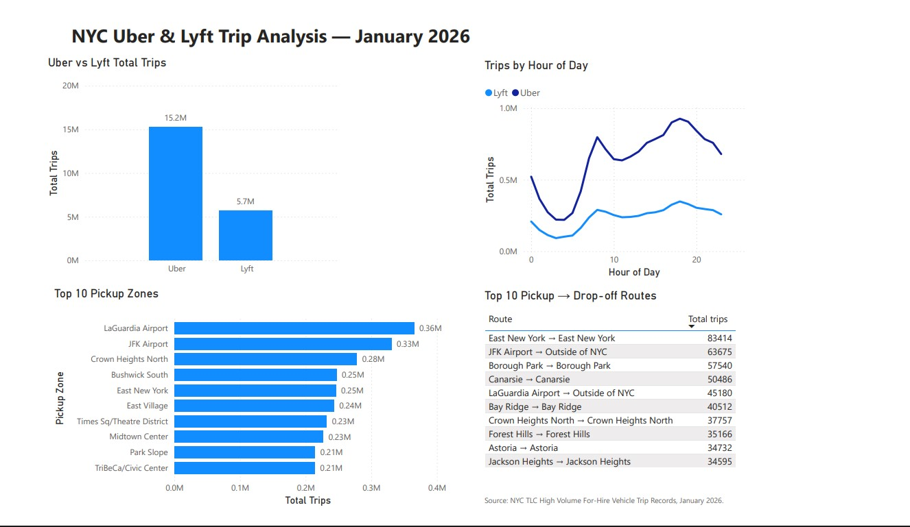

# NYC Uber & Lyft Trip Analysis

Analysis of approximately 20.9 million NYC Uber and Lyft trips from January 2026 using PostgreSQL, SQL and Power BI.

## Project Overview

This project explores patterns in New York City's High Volume For-Hire Vehicle trip data.

The analysis focuses on:
- Uber vs Lyft trip volumes
- Hourly demand patterns
- Busiest pickup zones
- Most common pickup-to-drop-off routes

## Tools Used

- PostgreSQL
- SQL
- Power BI
- Python / PyArrow for initial Parquet inspection and conversion

## Dataset

Source: [NYC Taxi & Limousine Commission — Trip Record Data](https://www.nyc.gov/site/tlc/about/tlc-trip-record-data.page)

The dataset contains approximately 20.9 million trips.

## Dashboard

## Key Findings

- Uber recorded approximately 15.2 million trips compared with 5.7 million for Lyft.
- Trip activity was lowest during the early morning hours and increased sharply during the morning.
- Demand reached its highest levels during the evening.
- LaGuardia Airport was the busiest pickup zone, followed by JFK Airport.
- East New York → East New York was the most common pickup-to-drop-off route in the analysis.

## SQL Analysis

The SQL analysis includes:
- Aggregations using `COUNT` and `AVG`
- Date and time analysis using `EXTRACT`
- Joins with NYC taxi zone lookup data
- Top-N analysis
- Pickup and drop-off route analysis

## Files

- [`nyc_rides_analysis.sql`](nyc_rides_analysis.sql) — SQL queries used for the analysis
- [`nyc_uber_lyft_dashboard.pdf`](nyc_uber_lyft_dashboard.pdf) — exported Power BI dashboard
- [`dashboard.jpg`](dashboard.jpg) — dashboard preview
